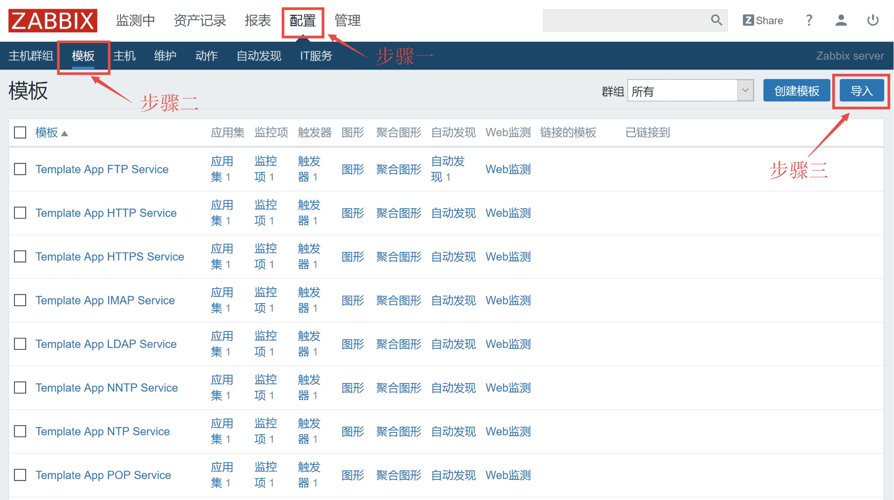
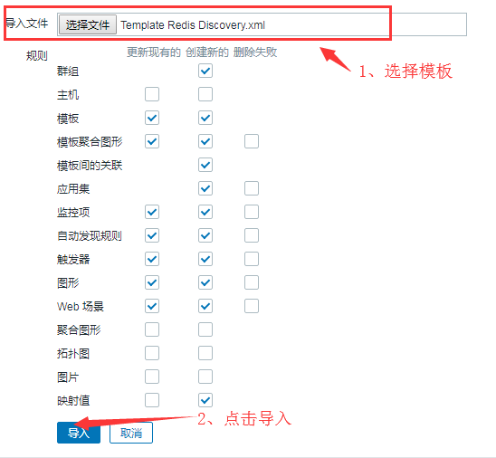
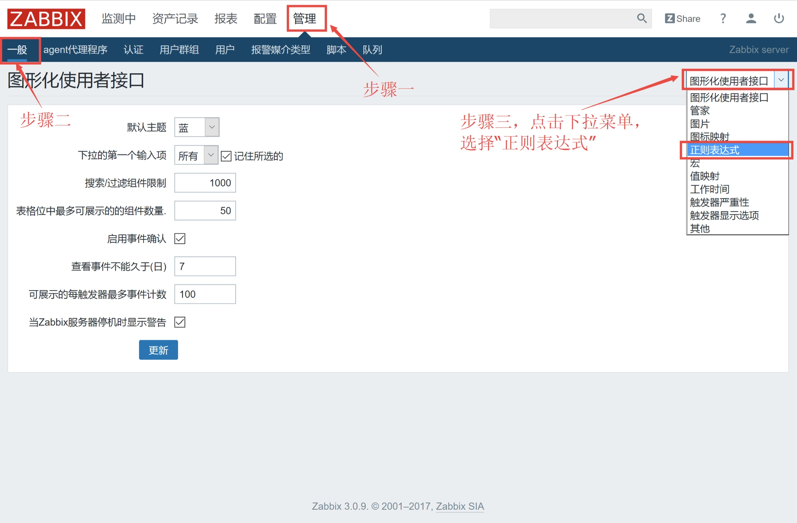
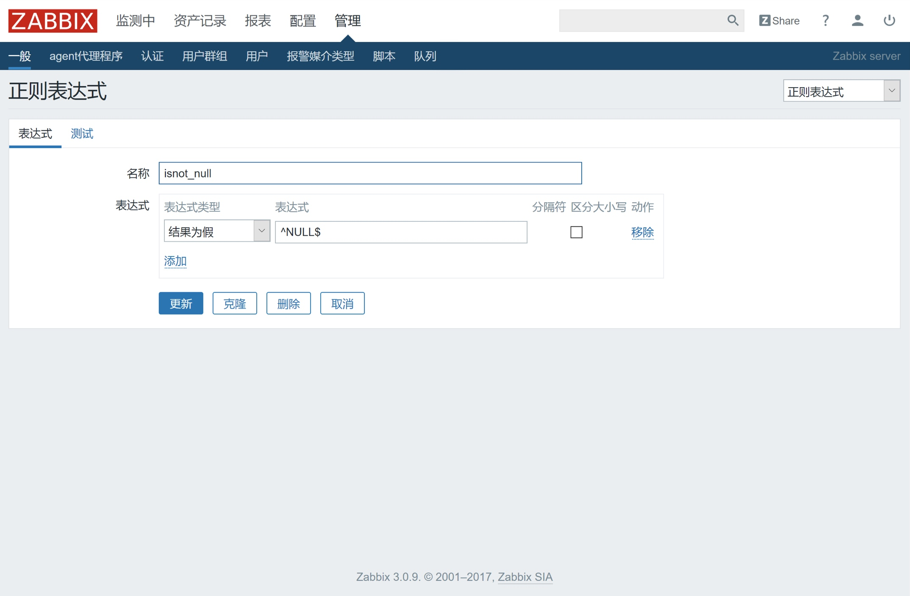
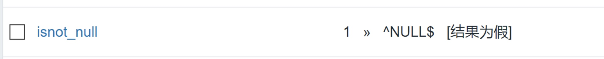

# Zabbix之Redis监控模板详解
## zabbix agent配置
1. 上传监控redis脚本和更改check_list.txt

```
[root@linux-node1 ~]# ll /server/scripts/zabbix_monitor/monitor_redis.sh
-rwxr-xr-x 1 root root 4020 Aug 16 10:49 /server/scripts/zabbix_monitor/monitor_redis.sh
[root@linux-node1 ~]# chmod +x /server/scripts/zabbix_monitor/monitor_redis.sh
[root@linux-node1 ~]# chown zabbix.zabbix /server/scripts/zabbix_monitor/check_list.txt
[root@linux-node1 ~]# chmod 600 /server/scripts/zabbix_monitor/check_list.txt
```

2. 将自定义监控文件monitor.conf文件上传到/etc/zabbix/zabbix_agentd.d下

```
[root@linux-node1 ~]# cat /etc/zabbix/zabbix_agentd.d/monitor.conf
# Redis
UserParameter=redis.discovery,sh /server/scripts/zabbix_monitor/monitor_redis.sh discovery
UserParameter=redis.slave.discovery,sh /server/scripts/zabbix_monitor/monitor_redis.sh slave_discovery
UserParameter=redis.ping[*],sh /server/scripts/zabbix_monitor/monitor_redis.sh ping $1
UserParameter=redis.uptime[*],sh /server/scripts/zabbix_monitor/monitor_redis.sh uptime $1
UserParameter=redis.tmpfile.md5[*],sh /server/scripts/zabbix_monitor/monitor_redis.sh tmpfile_md5 $1
UserParameter=redis.dbsize[*],sh /server/scripts/zabbix_monitor/monitor_redis.sh dbsize $1
UserParameter=redis.perf[*],sh /server/scripts/zabbix_monitor/monitor_redis.sh perf $2 $1
UserParameter=redis.conf[*],sh /server/scripts/zabbix_monitor/monitor_redis.sh conf $2 $1
```

3. zabbix agent配置文件开启agent主动模式

```
[root@linux-node1 ~]# vim /etc/zabbix/zabbix_agentd.conf
ServerActive=192.168.56.11
```

4. 配置Redis信息

```
[root@linux-node1 ~]# cat /server/scripts/zabbix_monitor/check_list.txt
redis:  6379    master  redis123.Com
```

5. check_list.txt文件配置Redis信息详解

```
第一行：服务名，端口号，主从，redis密码
```

## Zabbix界面配置
1. 导入模版


2. 选择导入摸板



3. 添加自动发现所需的正则表达式


4. 新建表达式


5. 添加正则表达式完成


6. 到此为止，Redis监控模板就可以正常使用了

